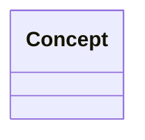

# 用户故事领域模型

> 维护领域对象、关系、生命周期和业务不变量。可用 `/story-context` 或 `/domain-model` 更新。

## 模型说明
- <领域模型覆盖的业务范围和关键假设>

## Mermaid 模型

## 关键关系
- <概念 A> 与 <概念 B>：<关系说明>

## 业务不变量
- <不变量 / 约束>

## 待验证点
- <需要通过验收场景验证的概念、关系或规则>
