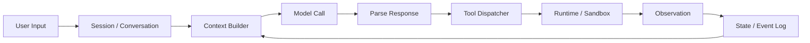

# Agent Harness Reverse Engineering Five-Step Method: Templates and Checklists

This file contains only source-reverse-engineering checklists and report templates for `agent-harness-reverse-five-step`. The seven veins, six forms, double-axis orthogonality rules, and Compound Error definition are in `agent-double-axis-framework.md`.

## Detect checklist

- [ ] Where does user input enter? CLI / UI / API / IDE / daemon?
- [ ] Where are the core conversation/session/turn objects?
- [ ] Where are messages/context/history constructed?
- [ ] Where does the LLM call happen? Is it streaming?
- [ ] Where are tool calls / function calls parsed?
- [ ] Where is the tool dispatcher / executor / runtime?
- [ ] How does observation/result enter the next round?
- [ ] When is state updated? Can it recover after failure?
- [ ] Where is the termination condition?

## Suggested search queries

```bash
rg "tool_call|function_call|tool_use|ToolCall|Action|Observation" .
rg "while|loop|step|run|turn|conversation|session" .
rg "messages|context|history|state" .
rg "completion|chat|model|llm|response|stream" .
rg "permission|sandbox|approval|policy|audit|trace|event" .
```

Cross-locate two lines:

- Entry line: user input / session / conversation / turn
- Model line: messages / context / model call / response / tool call

## Classify table template

| Component/file | Primary vein | Secondary vein | Resource budget | Strength None/Light/Heavy | What it controls | Why not another vein | Evidence |
|---|---|---|---|---|---|---|---|
|  | Perception / Memory / Reasoning / Action / Reflection / Collaboration / Governance |  | attention / continuity / uncertainty / irreversibility / correction / division of labor / trust |  |  |  |  |

## Filter decision tree

```text
Does this file change the Agent's decisions, context, state, actions, or permissions?
├─ No → mark as boilerplate / later
└─ Yes → what does it change?
   ├─ What the Agent sees → Perception
   ├─ What the Agent remembers → Memory
   ├─ How the Agent thinks → Reasoning
   ├─ What the Agent can do → Action
   ├─ How the Agent corrects itself → Reflection
   ├─ Who does the work → Collaboration
   └─ Boundaries/permissions/ledger → Governance
```

## Map matrix template

| Component/mechanism | Cognitive function | Execution topology | Implementation mechanism | Engineering benefit | Error propagation/failure mode | Evidence | Confidence |
|---|---|---|---|---|---|---|---|
|  |  | Chain / Route / Parallel / Orchestrate / Loop / Hierarchy | event log / sandbox / approval / shared state / etc. |  |  |  | high/medium/low |

## Verify evidence table template

| Architectural judgment | Evidence type | File/link | Line number/snippet | Explanation | Confidence |
|---|---|---|---|---|---|
|  | source / test / official docs |  |  |  |  |

## Mermaid main-loop template



## Default report structure

```markdown
# [Framework Name] Agent Harness Reverse Engineering Map

## 0. Executive summary
- One-sentence summary: what kind of runtime does this system put the model into?
- Architectural character: e.g. heavy sandbox / event-driven / repo-context-first / multi-agent-router-first
- Primary double-axis coordinates: which seven veins are Heavy? What is the primary six-form topology?
- Main error-propagation path: cascade / misroute / aggregation / decomposition error / compound error / hierarchy leakage
- Largest risk or uncertainty

## 1. Detect: main loop
[ASCII or Mermaid diagram with no more than 10 boxes]

- User input entry point: ...
- Model call location: ...
- Tool-result feedback path: ...
- State update location: ...

## 2. Classify: seven-vein component table
| Component | Primary vein | Secondary vein | Resource budget | Strength None/Light/Heavy | Role | Evidence |
|---|---|---|---|---|---|---|

## 3. Filter: first-pass noise and retained objects
### Read first
- ...
### Postpone
- ...

## 4. Map: Cognitive Function × Execution Topology matrix
| Component/mechanism | Cognitive function | Execution topology | Implementation mechanism | Engineering benefit | Error propagation/failure mode | Evidence |
|---|---|---|---|---|---|---|

## 5. Verify: evidence table
| Judgment | Evidence type | File/link | Key snippet/line number | Confidence |
|---|---|---|---|---|

## 6. Recommended next verification steps
- ...
```

## One-sentence conclusion template

- This is a **[architectural character]** Agent Harness: it puts the model inside **[core runtime]**, constrains action through **[key control plane]**, and uses **[state/event mechanism]** to support recovery, audit, or long-running tasks.

Example:

- This is a **sandbox-heavy, event-driven** Agent Harness: it puts the model inside a controlled runtime, constrains actions through permission policies and execution sandboxes, and uses an append-only event log to support recovery and audit.
