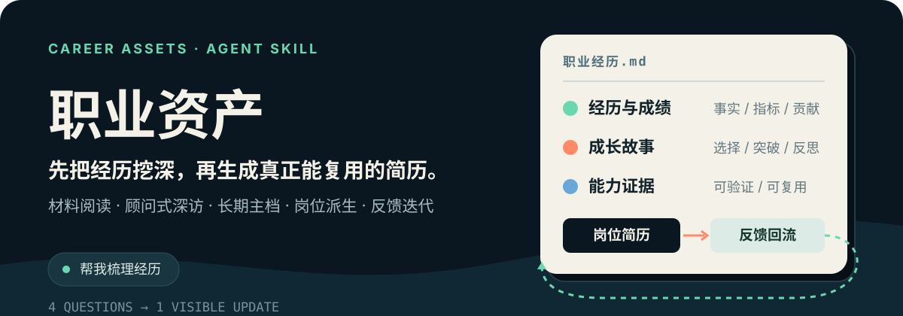

<!-- markdownlint-disable MD033 MD041 -->

> Upstream: [Ivor-NCUT/career-assets-skill](https://github.com/Ivor-NCUT/career-assets-skill), imported from commit `4f3208a04f5ea08e8d8d9dbbea87616fccf0dff5`.

<p align="center">
  
</p>

<p align="center">
  <strong>别急着润色简历。先把真正值得写的经历挖出来。</strong>
</p>

<p align="center">
  一个通过材料阅读与顾问式访谈，持续沉淀职业主档、派生岗位简历并吸收真实反馈的 Agent Skill。
</p>

## 从一句人话开始

你不需要先理解工作流，也不用填一张很长的表。直接说：

```text
帮我梳理经历
帮我出一版简历
继续补充
复盘投递/面试
```

Skill 会根据你的材料多少和求职紧急程度，自动决定先读材料、拉时间线、深挖关键经历，还是优先服务眼前的岗位。

## 最终留下的不是“一版简历”

一次普通的简历修改，交付的是一份很快过期的文档。`职业资产` 默认维护两类长期成果：

- **`职业经历.md`**：持续补充的职业主档，保存经历、成绩、证据、个人贡献与成长故事。
- **岗位定制简历**：从主档中选择与目标岗位最相关的内容，生成当前可投递版本。

投递与面试结果还会回到主档：哪种表达拿到约面、哪段项目讲不清、哪些证据仍然不足，都会成为下一轮优化的依据。

## 它怎么工作

1. **先分诊**：判断求职是否紧急、现有材料是否充足。
2. **先读再问**：把旧简历、项目集、个人网站等既当作事实线索，也当作需要重新审视的旧表达。
3. **混合深访**：沿时间线、成绩证据和成长故事追问，每个问题都服务于事实、证据或岗位表达。
4. **每 4 问整理一次**：边聊边给出可见进展，不让访谈变成没有尽头的问卷。
5. **先主档，后派生**：从同一份长期主档生成岗位简历、面试表达和后续版本。
6. **反馈回流**：把投递和面试中的真实结果写回，下一版因此更准。

## 和普通简历润色有什么不同

| 普通简历润色 | 职业资产 |
| --- | --- |
| 从现有措辞开始 | 从真实经历与证据开始 |
| 目标是今天改出一版 | 目标是建立可长期复用的主档 |
| 不同岗位重复从头写 | 从主档按岗位持续派生 |
| 修改结束后信息不再更新 | 投递与面试反馈继续回流 |

## 真实性是硬边界

生成简历时，内容会被明确拆成两层：

- **保真底稿**：只写你明确讲过、能被追问验证的事实；可以重组和提炼，但不编造数据、角色或结果。
- **强化建议**：把可能更有竞争力的表达单独列出，由你确认后再采用，不把猜测混进正文。

如果材料前后冲突，Skill 会先温和确认并保留待核实项，而不是擅自挑一个版本写进简历。

## 适合谁

- 不想只改措辞，想真正讲清职业经历的人。
- 正在转型，需要重新组织能力叙事的人。
- 同时投递多个公司、多个岗位，需要多版本简历的人。
- 希望每次投递和面试都能反哺下一版的人。

## 什么时候别用

这些任务更适合轻量简历工具：

- 只润色一页已有简历。
- 只缩短一段项目描述。
- 材料已经完整，只需一次性快速出稿。
- 站在招聘方视角筛选或推荐候选人。

## 安装

把仓库放进你的 Agent skills 目录，目录内保留 [`SKILL.md`](./SKILL.md)：

```bash
git clone https://github.com/Ivor-NCUT/career-assets-skill.git
```

如果你的 Agent 使用固定的 skills 根目录，把克隆后的目录移动或重命名到对应位置即可。

## 第一次使用

有材料时，可以这样开始：

```text
我不想只润色简历。我把旧简历和项目材料发给你，先帮我梳理经历。
```

材料很少也没关系：

```text
我想重新找工作，但现在没有一份像样的简历。先帮我把经历拉一条时间线。
```

有紧急岗位时，直接给目标：

```text
我明天要投 AI 产品经理。先用现有材料出一版，再告诉我最值得补什么。
```

## 仓库内容

- [`SKILL.md`](./SKILL.md)：触发边界、访谈节奏、产物结构、真实性规则和反馈闭环。
- [`README.md`](./README.md)：面向使用者的项目介绍与上手入口。
- [`assets/readme/hero.svg`](./assets/readme/hero.svg)：README 的项目原生视觉说明。

---

<p align="center"><strong>先把经历讲清楚，再让每一次投递都站在更完整的自己上。</strong></p>
